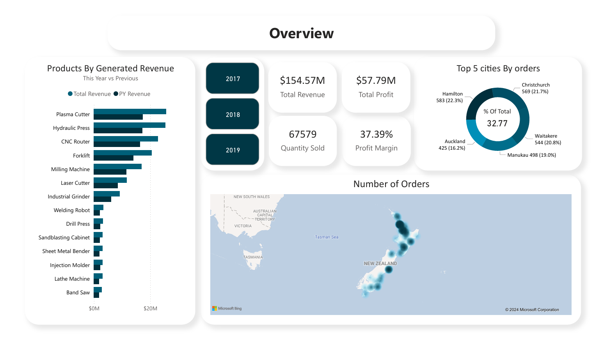
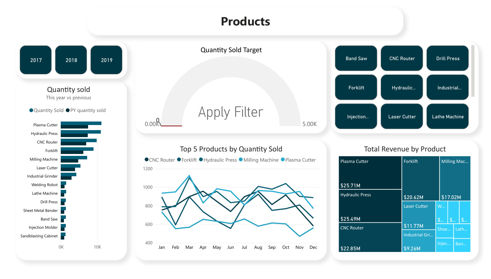
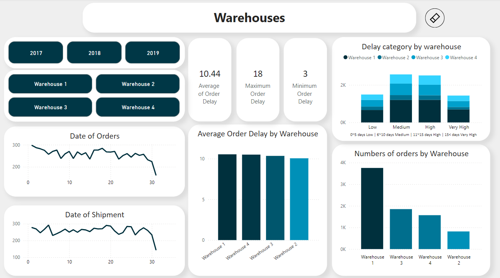

# Power BI Project: Sales and Warehouse Analysis Dashboard

## Overview

This project involves creating an interactive Power BI dashboard to analyze sales data, warehouse performance, product performance, and other key business metrics. The dashboard provides insights into various aspects of the business, including revenue generation, product sales, and warehouse efficiency.

## Dashboard Features

### 1. **Overview**

- **Top 5 Cities by Orders**: Visualizes the cities with the highest number of orders, allowing for quick identification of top-performing regions.
- **Total Revenue by Product**: A detailed breakdown of revenue contributions from different products.
- **Total orders Heatmap**: Displays the frequecy of orders in New Zealand

### 2. **Product Page**

- **Products by Generated Revenue**: Displays revenue generated by each product, comparing current year revenue to previous years.
- **Quantity Sold This Year vs. Previous Year**: Compares the quantity sold for each product this year versus the previous year.
- **Top 5 Products by Quantity Sold**: Highlights the most sold products, facilitating inventory and sales strategy planning.
- **Product Sales Trends**: Visualizes sales trends over the year to identify peak selling periods.
- **Product Target Achievement (Gauge Chart)**: Shows whether certain products achieved their custom target values for quantity sold, filtered by product and year slicers.
    - 🟢 Green: Target quota achieved (100% or more)
        

    - 🟡 Yellow: Near target achievement (90% to 99.9%)    
    

    - 🔴 Red: Below target (less than 90%)
    

    This color-coded system allows for quick identification of product performance relative to set goals.

- **Product and Year Filtering**: Users can filter the data by specific products and years, providing a customized view of performance metrics.

### 3. **Financial Performance**

- **Profit by Channel**: Analyzes profit margins across different sales channels such as wholesale, distributors, and exports.
- **Total Revenue and Profit by City**: Compares revenue and profit margins across various cities.
- **Total Revenue vs Previous Year**: Compares revenue of the current year based on the filter with the previous one with red 🔴 indicating underperforming in comparison with the same month last year and green 🟢 meaning overperforming 

- **Top customers by revenue generated**: Shows top customers by generated revenue

### 4. **Warehouse Performance**

- **Number of Orders by Warehouse**: Compares the volume of orders handled by different warehouses.
- **Average Order Delay**: Measures the efficiency of each warehouse by tracking the average delay in order processing and shipment.
- **Order Delays by Warehouse**: Identifies the warehouses with the highest delays, enabling targeted improvements.
- **Order and Ship Date Analysis**: Tracks trends in order and shipment dates to identify opportunities for optimizing logistics.

##### you can further filter and change the date periods using the slicers and drill down and drill up feature 
- Filter

- Drill Down and Up

## Technical Details

- **Power BI Version**: Power BI Desktop 2024
- **Data Sources**: 
        - [Excel File](./Sales%20Report.xlsx)

- **Data Transformation**: 
    - Implemented within Power BI using Power Query.
    - Data Modelling :

    
- **Visualizations**:
  - Bar charts
  - Line graphs
  - Map visuals
  - Gauge charts
  - Slicers for interactive filtering

## How to Use

1. **Filter Data**: Use the slicers to filter data by year, product, city, and other dimensions to focus on specific areas of interest.
2. **Interactive Insights**: Click on different parts of the visualizations to explore more detailed data and see how various metrics correlate.
3. **Custom Tooltips**: Hover over the data points to view additional context and details about the metrics displayed.

## Installation and Setup

1. Download and install [Power BI Desktop](https://powerbi.microsoft.com/desktop/).
2. Open the `.pbix` file provided with this project.
3. Refresh the data connections to load the most recent data.
4. Explore the dashboard and customize it based on your specific analysis needs.

## Project Goals

- Provide a comprehensive view of sales performance across different products and regions.
- Analyze warehouse efficiency and identify areas for improvement.
- Offer actionable insights for decision-makers to optimize sales strategies and warehouse operations.

## Conclusion

#### **Conclusion for the Year 2019**

- **Sales Decline**: Overall sales decreased by more than 10% compared to the previous year.
- **Product Performance**: All of the top 7 products experienced a decline in sales, contributing to the overall decrease.
- **Customer Impact**: A drop in sales is notably driven by just 4 key customers.
- **Profit Margins**: Despite the sales decline, the profit margin in the Export channel remains higher than in other channels.
- **Logistics Efficiency**: The average order delay has increased, indicating potential inefficiencies in the logistics process.
- **Warehouse Utilization**: Warehouse 4 is being overutilized, which may be contributing to the higher average order delay and overall logistics challenges.

## Contributor

- **Abdullah Mohammed Ibrahim** - Data Analysis and Power BI Dashboard Development
